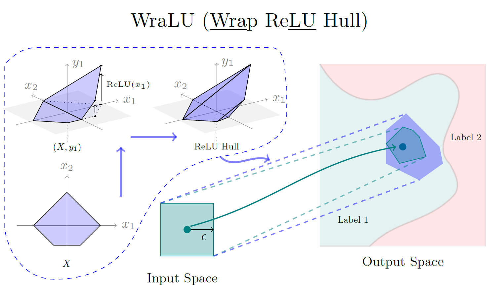

# WraLU: ReLU Hull Approximation 🚀



Welcome to **WraLU**—the **ReLU Hull Approximation** tool that’s revolutionizing neural network verification! 🎉 

WraLU is designed to calculate the **ReLU hull**, an essential technique for overcoming the challenges of non-linearity in activation functions. If you're working on neural network verification or robustness, WraLU is your go-to solution for fast and precise ReLU hull approximation. 

Our groundbreaking paper, **ReLU Hull Approximation**, has been accepted at **24'POPL** and is available here:

```tex
@article{10.1145/3632917,
author = {Ma, Zhongkui and Li, Jiaying and Bai, Guangdong},
title = {ReLU Hull Approximation},
year = {2024},
issue_date = {January 2024},
publisher = {Association for Computing Machinery},
address = {New York, NY, USA},
volume = {8},
number = {POPL},
url = {https://doi.org/10.1145/3632917},
doi = {10.1145/3632917},
month = {jan},
articleno = {75},
numpages = {28},
keywords = {Robustness, Polytope, Convexity, Neural Networks}
}
```

## What is WraLU?

WraLU is your **ultimate tool** for calculating ReLU hulls efficiently and accurately. Convex hulls are a critical tool in tackling the non-linearity of ReLU activation functions in neural network verification. Traditional methods can be slow and costly. WraLU drastically improves the process, delivering **fewer constraints, tighter approximations, and faster results**—all while being **versatile** and scalable, handling both simple and complex networks effortlessly.

We’ve integrated WraLU into **PRIMA (ERAN project, https://github.com/eth-sri/eran)**, a state-of-the-art neural network verifier, making it easy to apply to large-scale ReLU-based neural networks. Ready to verify and experiment? Let’s dive in! 🔥

## Installation Guide 🛠️

### Install WraLU

First, cd to `WraLU` directory and bash `install.sh` or manually install the necessary libraries (refer to https://github.com/eth-sri/eran).

Our core algorithm is in `WraLU/kact/krelu/sci.py`

You need to download network files from ERAN and put them in `nets/onnx`.

### Run Experiments of ReLU hull approximation

We compare different methods, including one exact method and one approximate method from the state-of-the-art technologies with our two methods.

First, you need to generate some polytope samples.

```bash
cd experiments_hull
cd polytope_samples
python3 sample_generator.py
cd ..
```

Next, calculate the bounds of variables of the polytopes samples.

```bash
cd polytope_bounds
python3 cal_polytope_bounds.py
cd ..
```

Then, we run different methods to calculate the ReLU hull.

```bash
cd output_constraints
python3 cal_constraints.py
cd ..
```

Finally, we calculate the volumes of the resulting polytopes by different methods to compare their precision.

```bash
cd volumes
python3 cal_volume.py
cd ../..
```

### Run Experiments of Neural Network Verification

In this section, we integrate our methods in PRIMA and assess its performance on neural network verification.

```bash
cd experiments
cd run_cpu
```

If you want to run a small example to test our methods.

```bash
bash example.sh
```

If you want to compare the different grouping strategies on a small network (3*50), run the following code.

```bash
bash test_hyperparameters.sh
```

If you want to run the verification on ERAN benchmarks, run the following code.

```bash
bash eran_benchmarks.sh
```

If you want to run the verification on our benchmarks, run the following code.

```bash
bash our_benchmarks.sh
```

If you want to compare with DeepZono, run the following code.

```bash
bash eran_benchmarks_deepzono.sh
```

### Join the Revolution! 🌟

WraLU is the perfect tool for anyone looking to verify RELU with **precision** and **efficiency**. Whether you're working on research, development, or benchmarking, WraLU takes your verification game to the next level. Try it now and experience the future of neural network verification! 🚀
